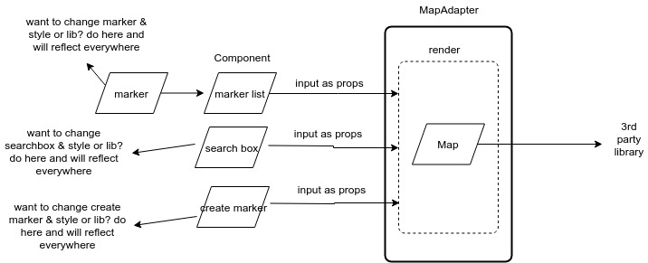

# Front end application to manage Markers on google map

## Prerequisite

1. Back end application
2. NPM

## Configuration Instruction

package.json file has following values configuration

1. REACT_APP_GOOGLE_V3_API=XXXXX. To use google map.
2. REACT_APP_API_URL=XXXXXX. To declare API end point. Default - http://localhost.
3. REACT_APP_API_PORT=XXXXX. To declare API end point port. Default - 3003.

## Built Instruction

1. run `npm install` to install dependencies.
2. run `npm run ui` to launch ui.

## Design details

